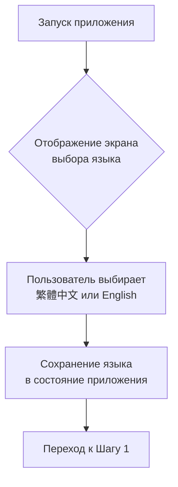
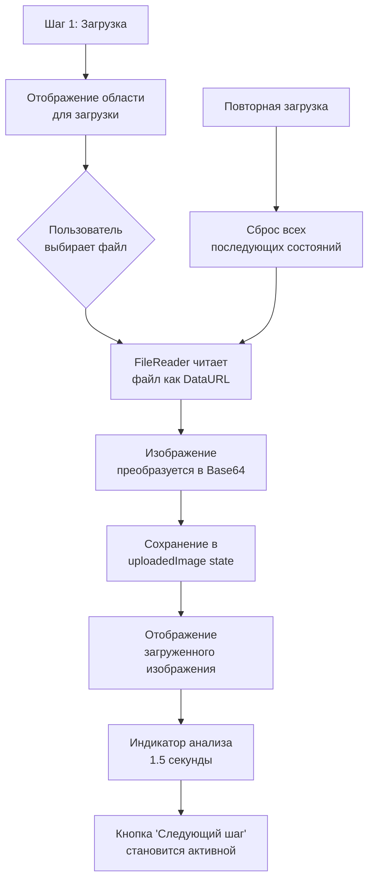
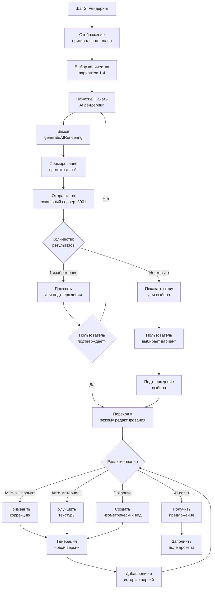
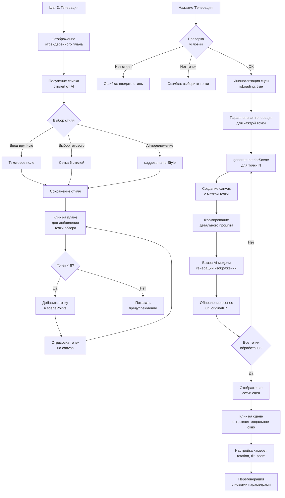
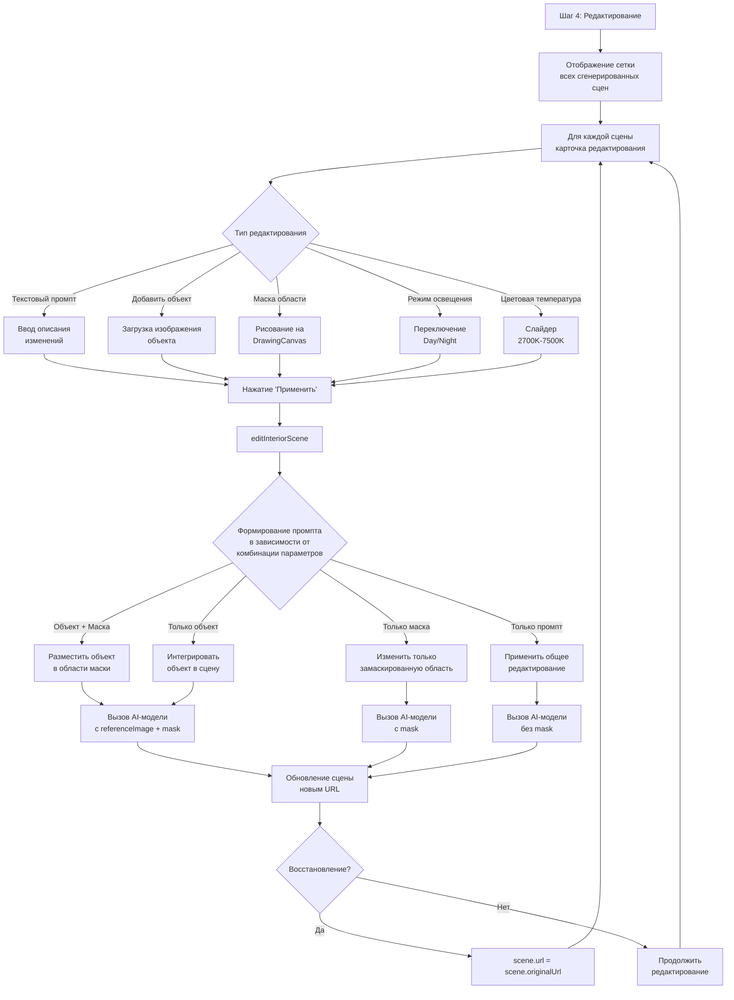
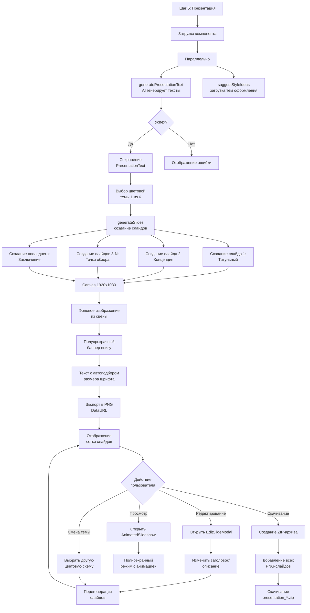
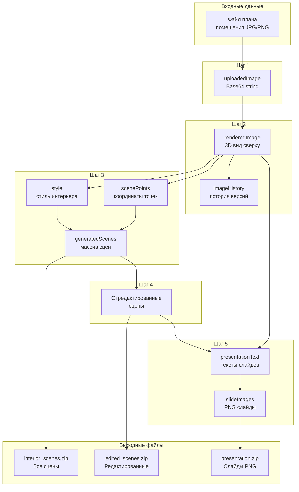

# Алгоритм работы приложения AIStudioFloorPlan

## Общее описание

**AIStudioFloorPlan** — это веб-приложение для преобразования архитектурных планов помещений в фотореалистичные 3D-визуализации интерьеров и автоматической генерации презентаций. Приложение использует локальные AI-модели для обработки изображений и генерации текста.

---

## Архитектура системы

```
┌─────────────────────────────────────────────────────────────────────────────┐
│                           КЛИЕНТСКОЕ ПРИЛОЖЕНИЕ (React)                      │
├─────────────────────────────────────────────────────────────────────────────┤
│  App.tsx (главный компонент, управление состоянием)                          │
│     │                                                                        │
│     ├── LanguageSelector     ← Выбор языка интерфейса                       │
│     ├── Stepper              ← Индикатор текущего шага                      │
│     ├── Step1Upload          ← Загрузка плана помещения                     │
│     ├── Step2Rendering       ← AI-рендеринг плана                           │
│     ├── Step3SceneGeneration ← Генерация интерьерных сцен                   │
│     ├── Step4SceneEditing    ← Редактирование сцен                          │
│     └── Step5Presentation    ← Генерация презентации                        │
├─────────────────────────────────────────────────────────────────────────────┤
│                           СЕРВИСНЫЙ СЛОЙ                                     │
│  services/geminiService.ts   ← Взаимодействие с AI-моделями                 │
│  lib/presentationUtils.ts    ← Утилиты для создания слайдов                 │
│  lib/i18n.ts                 ← Многоязычная поддержка (EN/ZH)               │
├─────────────────────────────────────────────────────────────────────────────┤
│                           ЛОКАЛЬНЫЕ AI-СЕРВЕРЫ                               │
│  ┌─────────────────────┐    ┌─────────────────────┐                         │
│  │ Текстовая/Vision    │    │ Генерация           │                         │
│  │ модель (Qwen 2.5)   │    │ изображений         │                         │
│  │ :8000               │    │ :8001               │                         │
│  └─────────────────────┘    └─────────────────────┘                         │
└─────────────────────────────────────────────────────────────────────────────┘
```

---

## Детальный алгоритм по шагам

### Шаг 0: Выбор языка интерфейса



**Компонент:** `LanguageSelector.tsx`

**Действия:**
1. При первом запуске отображается экран выбора языка
2. Доступные опции: Traditional Chinese (繁體中文) и English
3. Выбранный язык сохраняется в состояние `language`
4. Все UI-элементы автоматически переводятся через функцию `getTranslation()`

---

### Шаг 1: Загрузка плана помещения



**Компонент:** `Step1Upload.tsx`

**Входные данные:**
- Файл изображения плана помещения (JPG, PNG, и др.)

**Выходные данные:**
- `uploadedImage: string` — Base64-представление изображения

**Алгоритм:**
1. Пользователь нажимает кнопку "Выбрать план" или "Выбрать другой план"
2. Открывается диалог выбора файла (accept="image/*")
3. При выборе файла:
   ```javascript
   const reader = new FileReader();
   reader.onloadend = () => {
       const imageUrl = reader.result as string; // data:image/...;base64,...
       onImageUpload(imageUrl);
   };
   reader.readAsDataURL(file);
   ```
4. Отображается короткий индикатор "Анализ плана..." (1.5 сек)
5. При повторной загрузке сбрасываются все последующие состояния:
   - `renderedImage` = ''
   - `style` = ''
   - `generatedScenes` = []
   - `scenePoints` = []

---

### Шаг 2: AI-рендеринг плана



**Компонент:** `Step2Rendering.tsx`

**Входные данные:**
- `originalImage: string` — загруженный план

**Выходные данные:**
- `renderedImage: string` — отрендеренный 3D-план (вид сверху)

**Основные функции:**

#### 2.1 Начальная генерация (`handleInitialGeneration`)
```javascript
const results = await generateAIRendering(
    originalImage,      // Исходное изображение
    undefined,          // Промпт (используется дефолтный)
    undefined,          // Маска (не используется)
    numberOfImages      // Количество вариантов (1-4)
);
```

**Дефолтный промпт для рендеринга:**
```
Transform this 2D architectural floor plan into a precise, high-quality 
3D rendered top-down view with the following requirements:

CLEANING REQUIREMENTS:
- COMPLETELY REMOVE all text, Chinese characters, numbers, dimension markings...

SYMBOL INTERPRETATION:
- Rectangle with vertical lines → wardrobe (衣櫃)
- Rectangle with large 'X' → storage cabinet (收納櫃)

ARCHITECTURAL PRECISION:
- Maintain exact wall positions, thicknesses, and openings...

VISUAL ENHANCEMENT:
- Add realistic architectural materials...
```

#### 2.2 Коррекция с маской (`submitCorrection`)
```javascript
const results = await generateAIRendering(
    renderedImage,      // Текущий рендер
    correctionInput,    // Описание изменения
    maskBase64,         // Маска области редактирования
    numberOfImages      // Количество вариантов
);
```

#### 2.3 Автоматические материалы (`applyAutoMaterial`)
Применяет реалистичные материалы и текстуры:
- Разные материалы полов для разных комнат
- Текстуры стен
- Разнообразие цветов мебели
- Освещение и тени

#### 2.4 Dollhouse-вид (`handleDollhouseGeneration`)
Преобразует плоский вид в изометрическую 3D-визуализацию:
- 45-градусная аксонометрическая перспектива
- Полная меблировка всех комнат
- Декоративные элементы
- Реалистичное освещение

#### 2.5 AI-совет (`handleSuggestImprovement`)
```javascript
const suggestion = await suggestPlanImprovements(renderedImage);
// Пример результата: "Add a kitchen island for more counter space."
```

**Компонент рисования маски:** `DrawingCanvas.tsx`
- Позволяет рисовать области для редактирования
- Генерирует черно-белую маску (белый = область редактирования)

---

### Шаг 3: Генерация интерьерных сцен



**Компонент:** `Step3SceneGeneration.tsx`

**Входные данные:**
- `finalPlanImage: string` — отрендеренный план
- `style: string` — выбранный стиль интерьера
- `scenePoints: ScenePoint[]` — координаты точек обзора

**Выходные данные:**
- `generatedScenes: GeneratedScene[]` — массив сгенерированных сцен

**Структура GeneratedScene:**
```typescript
interface GeneratedScene {
    url: string;              // Текущее изображение сцены
    originalUrl: string;      // Оригинал для восстановления
    viewIndex: number;        // Номер точки обзора (1-8)
    style: string;            // Примененный стиль
    isLoading: boolean;       // Флаг загрузки
    error?: string;           // Сообщение об ошибке
    camera: {
        rotation: number;     // Поворот камеры (-180 до 180)
        tilt: number;         // Наклон камеры (-45 до 45)
        zoom: number;         // Масштаб (0.5 до 2)
    };
    mode: 'day' | 'night';    // Режим освещения
    temperature: number;      // Цветовая температура (2700K-7500K)
}
```

**Алгоритм генерации сцены (`generateInteriorScene`):**

1. **Подготовка изображения с меткой:**
```javascript
// Создание canvas с отметкой точки обзора
const canvas = document.createElement('canvas');
canvas.width = img.naturalWidth;
canvas.height = img.naturalHeight;
ctx.drawImage(img, 0, 0);

// Рисование красного круга с номером
ctx.arc(pointX, pointY, radius, 0, 2 * Math.PI);
ctx.fillStyle = 'rgba(255, 0, 0, 0.8)';
ctx.fillText(viewIndex.toString(), pointX, pointY);
```

2. **Формирование промпта:**
```javascript
const promptDetails = [
    `Generate a photorealistic FIRST-PERSON VIEW interior photograph 
     from the perspective of viewpoint ${viewIndex}...`,
    `STYLE & ATMOSPHERE: The interior design style is "${style}".`,
    `LIGHTING: ${mode === 'day' ? 'bright, naturally lit...' : 'dramatic nighttime...'}`,
    `CAMERA VIEW: At human eye-level (1.6m).${cameraInstructions}`,
    `COMPOSITION: Complete indoor scene with walls, ceiling, floor, furniture...`,
    `CRITICAL: Output MUST be ground-level, horizontal photograph...`
];
```

3. **Отправка запроса:**
```javascript
return await generateArchitecturalImage({
    prompt,
    baseImage: { mimeType: 'image/png', data: imageWithPointBase64 }
});
```

**Интерактивный просмотр:** `InteractiveSceneModal.tsx`
- Позволяет настраивать параметры камеры
- При изменении параметров — перегенерация сцены

---

### Шаг 4: Редактирование сцен



**Компонент:** `Step4SceneEditing.tsx`

**Входные данные:**
- `scenes: GeneratedScene[]` — сгенерированные сцены

**Выходные данные:**
- Обновленные сцены с примененными изменениями

**Функция редактирования (`editInteriorScene`):**

```javascript
async function editInteriorScene(
    baseImageSrc: string,      // Текущее изображение сцены
    prompt: string,            // Описание изменений
    mode: 'day' | 'night',     // Режим освещения
    temperature: number,       // Цветовая температура
    maskBase64?: string,       // Маска области (опционально)
    objectImageBase64?: string // Изображение объекта (опционально)
): Promise<string>
```

**Варианты редактирования:**

1. **Объект + Маска:**
```
Разместить объект из OBJECT image в белую область MASK.
Инструкция пользователя: "${prompt}"
Освещение: ${lightingDescription}
```

2. **Только объект:**
```
Интегрировать объект из OBJECT image в сцену.
Инструкция размещения: "${prompt}"
```

3. **Только маска:**
```
Изменить ТОЛЬКО белую область маски: "${prompt}"
Черная область маски должна остаться неизменной.
```

4. **Общее редактирование:**
```
Применить изменение: "${prompt}"
Освещение: ${lightingDescription}
```

---

### Шаг 5: Генерация презентации



**Компонент:** `Step5Presentation.tsx`

**Входные данные:**
- `finalPlanImage: string` — отрендеренный план
- `generatedScenes: GeneratedScene[]` — все сгенерированные сцены
- `style: string` — выбранный стиль интерьера

**Выходные данные:**
- `slideImages: string[]` — PNG-изображения слайдов в формате DataURL

**Структура текстов презентации:**
```typescript
interface PresentationText {
    presentationTitle: string;           // Креативный заголовок
    conceptTitle: string;                 // Заголовок концепции
    mainConcepts: string[];              // 4 ключевые концепции
    viewpointDetails: {                  // Для каждой точки обзора
        title: string;
        description: string;
    }[];
    conclusionTitle: string;             // Заголовок заключения
    conclusion: string;                  // Текст заключения
}
```

**Алгоритм генерации текстов (`generatePresentationText`):**

1. Отправка плана и всех сцен в AI-модель
2. Промпт с требованиями:
   - Язык вывода соответствует выбранному языку интерфейса
   - Строгие лимиты на длину текстов
   - JSON-формат ответа

**Алгоритм создания слайдов (`generateSlides`):**

1. **Параметры canvas:**
```javascript
const CANVAS_WIDTH = 1920;
const CANVAS_HEIGHT = 1080;
const BANNER_Y = CANVAS_HEIGHT * 0.6;  // Баннер занимает нижние 40%
```

2. **Типы слайдов:**
   - **Титульный:** Фон из первой сцены + заголовок презентации
   - **Концепция:** Фон из плана + 4 ключевые концепции
   - **Точки обзора:** Фон из соответствующей сцены + описание
   - **Заключение:** Фон из последней сцены + итоговый текст

3. **Цветовые темы:**
```javascript
const themes = [
    { name: 'Modern Blue', primaryText: '#1E3A8A', accent: '#3B82F6' },
    { name: 'Earth Tones', primaryText: '#5D4037', accent: '#A1887F' },
    { name: 'Minimalist Gray', primaryText: '#111827', accent: '#6B7280' },
    { name: 'Vibrant Creative', primaryText: '#854D0E', accent: '#F59E0B' },
    { name: 'Elegant Noir', primaryText: '#FFFFFF', accent: '#D4AF37' },
    { name: 'Sakura Pink', primaryText: '#5B21B6', accent: '#F472B6' }
];
```

---

## Взаимодействие с AI-сервисами

### Конфигурация

```
.env.local:
VITE_LOCAL_TEXT_API_BASE=http://localhost:8000
VITE_LOCAL_TEXT_MODEL=qwen2.5-72b-instruct
VITE_LOCAL_VISION_MODEL=qwen2.5-vl
VITE_LOCAL_IMAGE_API_BASE=http://localhost:8001
VITE_LOCAL_IMAGE_MODEL=qwen-image-edit
VITE_LOCAL_API_KEY=your-local-token
```

### API-эндпоинты

#### Текстовая/Vision модель
```
POST {TEXT_API_BASE}/v1/chat/completions
Content-Type: application/json

{
    "model": "qwen2.5-72b-instruct",
    "messages": [{
        "role": "user",
        "content": [
            { "type": "text", "text": "..." },
            { "type": "image_url", "image_url": { "url": "data:image/png;base64,..." } }
        ]
    }],
    "temperature": 0.4
}
```

#### Генерация изображений (без базового изображения)
```
POST {IMAGE_API_BASE}/v1/images/generations
Content-Type: application/json

{
    "prompt": "...",
    "model": "qwen-image-edit",
    "n": 1,
    "response_format": "b64_json"
}
```

#### Редактирование изображений (с базовым изображением)
```
POST {IMAGE_API_BASE}/v1/images/edits
Content-Type: multipart/form-data

- prompt: string
- model: string
- n: number
- response_format: "b64_json"
- image: Blob (base-image.png)
- mask: Blob (mask-image.png) [опционально]
- reference_image: Blob (reference-image.png) [опционально]
```

### Механизм повторных попыток

```javascript
const maxAttempts = 5;
let attempts = 0;

while (attempts < maxAttempts) {
    try {
        return await callLocalImageModel(options);
    } catch (error) {
        attempts++;
        if (attempts >= maxAttempts) throw error;
        
        // Экспоненциальная задержка: 1s, 2s, 4s, 8s (max 8s)
        const backoffTime = Math.min(Math.pow(2, attempts) * 500, 8000);
        await new Promise(resolve => setTimeout(resolve, backoffTime));
    }
}
```

---

## Диаграмма потока данных



---

## Сводная таблица функций geminiService

| Функция | Назначение | API | Входные данные | Выходные данные |
|---------|------------|-----|----------------|-----------------|
| `generateAIRendering` | Рендеринг плана в 3D | Image Edit | план + промпт + маска | URL изображения |
| `generateInteriorScene` | Генерация вида интерьера | Image Edit | план + координаты + стиль | URL изображения |
| `editInteriorScene` | Редактирование сцены | Image Edit | сцена + промпт + маска + объект | URL изображения |
| `suggestInteriorStyle` | Предложение стиля | Vision Chat | план | Название стиля |
| `suggestPlanImprovements` | Предложение улучшений | Vision Chat | план | Текст предложения |
| `suggestStyleIdeas` | Список стилей | Text Chat | — | Массив стилей |
| `generatePresentationText` | Тексты презентации | Vision Chat | план + сцены + стиль | PresentationText |

---

## Структура выходных файлов

### ZIP со сценами (Шаг 3)
```
interior_scenes_2026-01-31.zip
├── viewpoint_1_Modern Minimalist.png
├── viewpoint_2_Modern Minimalist.png
├── viewpoint_3_Modern Minimalist.png
└── ...
```

### ZIP с отредактированными сценами (Шаг 4)
```
edited_scenes_2026-01-31.zip
├── edited_scene_1.png
├── edited_scene_2.png
├── edited_scene_3.png
└── ...
```

### ZIP с презентацией (Шаг 5)
```
presentation_Modern_Minimalist.zip
├── slide_1.png    (Титульный)
├── slide_2.png    (Концепция)
├── slide_3.png    (Точка обзора 1)
├── slide_4.png    (Точка обзора 2)
├── ...
└── slide_N.png    (Заключение)
```

**Размер слайдов:** 1920 × 1080 пикселей (Full HD)
