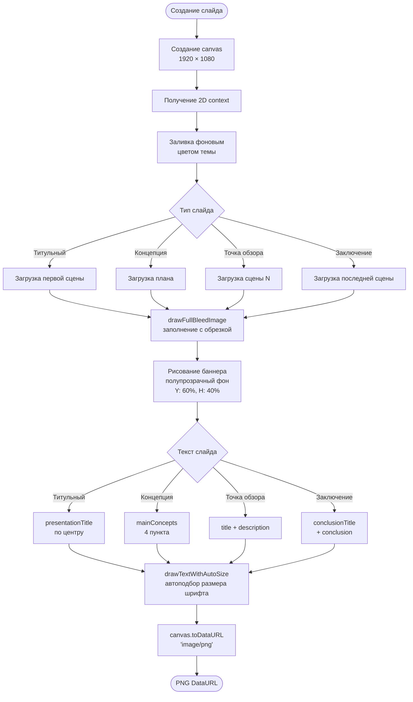
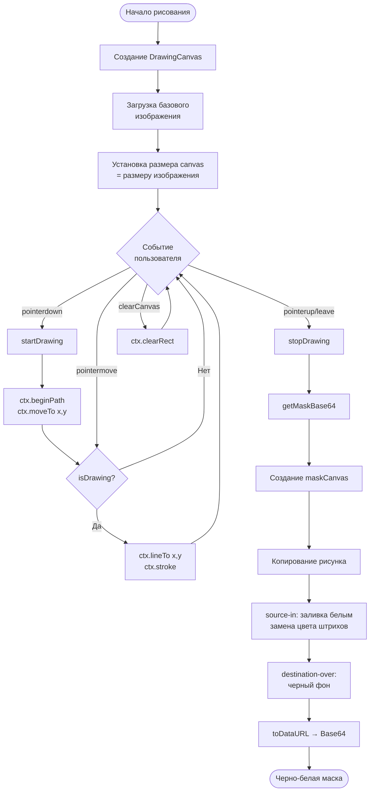
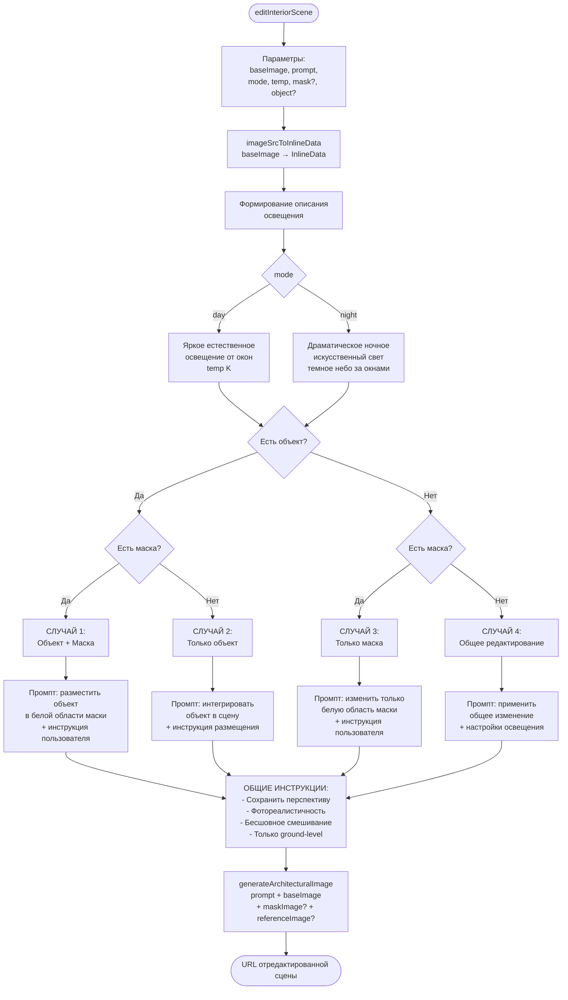
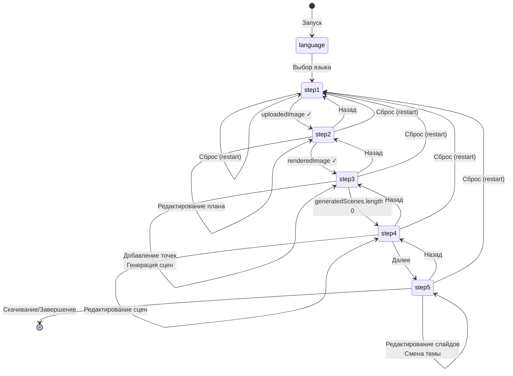
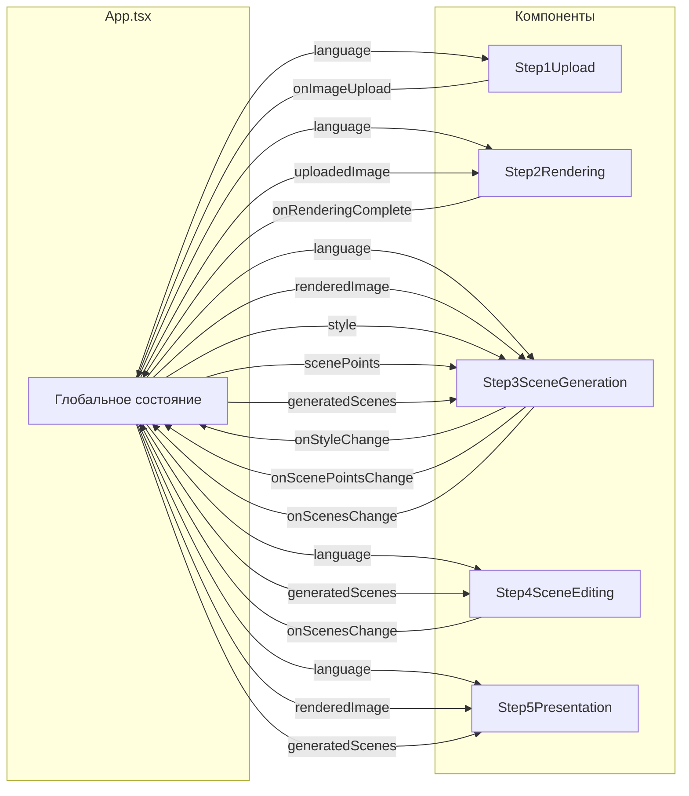
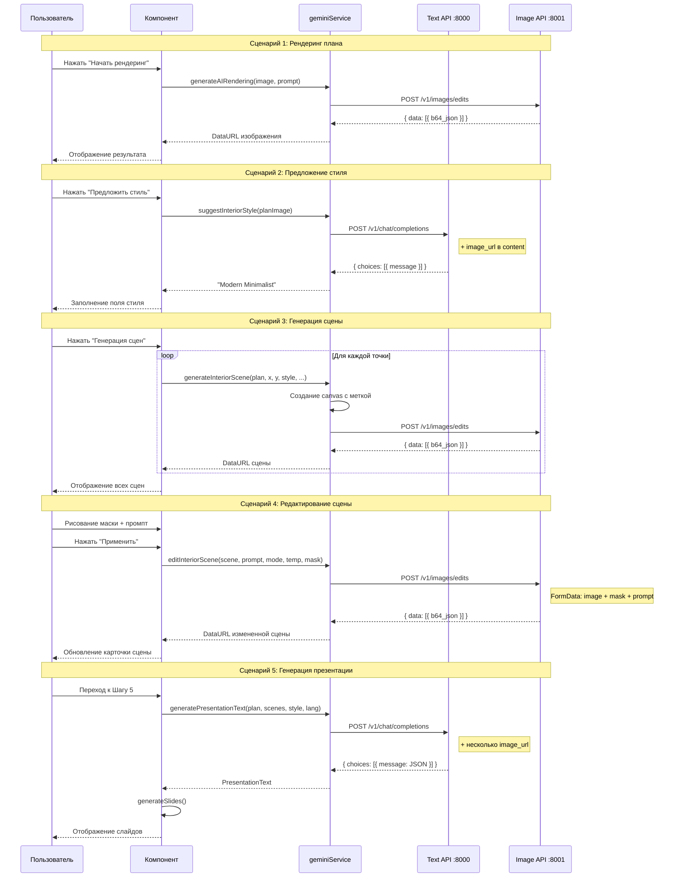

# Блок-схемы алгоритмов AIStudioFloorPlan

## Главная блок-схема приложения

```mermaid
flowchart TD
    START([Запуск приложения]) --> LANG{Выбор языка}
    
    LANG -->|繁體中文| STEP1
    LANG -->|English| STEP1
    
    subgraph STEP1 [Шаг 1: Загрузка плана]
        S1_1[Отображение интерфейса загрузки]
        S1_2[Пользователь выбирает файл]
        S1_3[FileReader преобразует в Base64]
        S1_4[Сохранение в uploadedImage]
        S1_5{План загружен?}
        
        S1_1 --> S1_2 --> S1_3 --> S1_4 --> S1_5
    end
    
    S1_5 -->|Нет| S1_1
    S1_5 -->|Да| STEP2
    
    subgraph STEP2 [Шаг 2: AI-рендеринг]
        S2_1[Отображение оригинала и области рендера]
        S2_2[Выбор количества вариантов]
        S2_3[Нажатие 'Начать рендеринг']
        S2_4[Вызов generateAIRendering]
        S2_5{Несколько вариантов?}
        S2_6[Выбор из сетки]
        S2_7[Подтверждение результата]
        S2_8[Режим редактирования]
        S2_9{Требуется коррекция?}
        S2_10[Рисование маски + промпт]
        S2_11[Применение коррекции]
        S2_12{Результат OK?}
        
        S2_1 --> S2_2 --> S2_3 --> S2_4 --> S2_5
        S2_5 -->|Да| S2_6 --> S2_7
        S2_5 -->|Нет| S2_7
        S2_7 -->|Принять| S2_8
        S2_7 -->|Отклонить| S2_3
        S2_8 --> S2_9
        S2_9 -->|Да| S2_10 --> S2_11 --> S2_12
        S2_12 -->|Нет| S2_10
        S2_12 -->|Да| S2_9
    end
    
    S2_9 -->|Нет| STEP3
    
    subgraph STEP3 [Шаг 3: Генерация сцен]
        S3_1[Отображение плана с canvas]
        S3_2[Выбор/ввод стиля интерьера]
        S3_3[Клик на плане - добавление точки]
        S3_4{Точек достаточно?}
        S3_5[Нажатие 'Генерация сцен']
        S3_6[Параллельная генерация всех сцен]
        S3_7[Отображение сетки результатов]
        S3_8{Настройка камеры?}
        S3_9[Изменение rotation/tilt/zoom]
        S3_10[Перегенерация сцены]
        
        S3_1 --> S3_2 --> S3_3 --> S3_4
        S3_4 -->|Нет| S3_3
        S3_4 -->|Да| S3_5 --> S3_6 --> S3_7 --> S3_8
        S3_8 -->|Да| S3_9 --> S3_10 --> S3_7
    end
    
    S3_8 -->|Нет| STEP4
    
    subgraph STEP4 [Шаг 4: Редактирование сцен]
        S4_1[Отображение карточек сцен]
        S4_2{Тип редактирования}
        S4_3[Текстовый промпт]
        S4_4[Загрузка объекта]
        S4_5[Рисование маски]
        S4_6[Настройка освещения]
        S4_7[Применение изменений]
        S4_8[editInteriorScene]
        S4_9[Обновление сцены]
        S4_10{Продолжить редактирование?}
        
        S4_1 --> S4_2
        S4_2 -->|Промпт| S4_3 --> S4_7
        S4_2 -->|Объект| S4_4 --> S4_7
        S4_2 -->|Маска| S4_5 --> S4_7
        S4_2 -->|Освещение| S4_6 --> S4_7
        S4_7 --> S4_8 --> S4_9 --> S4_10
        S4_10 -->|Да| S4_2
    end
    
    S4_10 -->|Нет| STEP5
    
    subgraph STEP5 [Шаг 5: Презентация]
        S5_1[Генерация текстов презентации]
        S5_2[Выбор цветовой темы]
        S5_3[generateSlides создает слайды]
        S5_4[Отображение превью слайдов]
        S5_5{Редактирование текста?}
        S5_6[Открыть EditSlideModal]
        S5_7[Сохранить изменения]
        S5_8[Перегенерация слайдов]
        S5_9{Финальное действие}
        S5_10[Просмотр слайдшоу]
        S5_11[Скачивание ZIP]
        
        S5_1 --> S5_2 --> S5_3 --> S5_4 --> S5_5
        S5_5 -->|Да| S5_6 --> S5_7 --> S5_8 --> S5_4
        S5_5 -->|Нет| S5_9
        S5_9 -->|Просмотр| S5_10
        S5_9 -->|Скачать| S5_11
    end
    
    S5_10 --> END([Завершение])
    S5_11 --> END
```



---

## Детальная схема генерации изображения

```mermaid
flowchart TD
    START([Запрос на генерацию]) --> CHECK{Тип запроса}
    
    CHECK -->|Без базового<br/>изображения| GEN[/v1/images/generations]
    CHECK -->|С базовым<br/>изображением| EDIT[/v1/images/edits]
    
    GEN --> GEN_REQ[JSON запрос:<br/>prompt, model, n,<br/>response_format]
    
    EDIT --> EDIT_REQ[FormData запрос:<br/>prompt, model, image]
    EDIT_REQ --> HAS_MASK{Есть маска?}
    HAS_MASK -->|Да| ADD_MASK[+ mask blob]
    HAS_MASK -->|Нет| HAS_REF{Есть reference?}
    ADD_MASK --> HAS_REF
    HAS_REF -->|Да| ADD_REF[+ reference_image blob]
    HAS_REF -->|Нет| SEND
    ADD_REF --> SEND
    
    GEN_REQ --> SEND[Отправка на<br/>IMAGE_API_BASE]
    
    SEND --> RESPONSE{Ответ сервера}
    
    RESPONSE -->|Успех| PARSE[Парсинг JSON]
    RESPONSE -->|Ошибка| RETRY{Попытка < 5?}
    
    RETRY -->|Да| BACKOFF[Экспоненциальная<br/>задержка]
    BACKOFF --> SEND
    RETRY -->|Нет| ERROR([Выброс исключения])
    
    PARSE --> FORMAT{Формат данных}
    
    FORMAT -->|b64_json| B64[data:image/png;base64,<br/>+ payload.data[0].b64_json]
    FORMAT -->|url| FETCH[fetchImageAsDataUrl<br/>загрузка по URL]
    FORMAT -->|Нет данных| ERROR
    
    B64 --> RESULT([DataURL изображения])
    FETCH --> RESULT
```

---

## Схема создания слайда презентации



---

## Схема рисования маски



---

## Схема генерации интерьерной сцены

```mermaid
flowchart TD
    START([generateInteriorScene]) --> PARAMS[Параметры:<br/>planImage, x, y, style,<br/>viewIndex, camera, mode, temp]
    
    PARAMS --> CANVAS[Создание canvas<br/>с размерами изображения]
    
    CANVAS --> DRAW_IMG[Рисование плана<br/>на canvas]
    
    DRAW_IMG --> MARK[Рисование метки<br/>точки обзора]
    
    MARK --> CIRCLE[Красный круг<br/>radius=25, opacity=0.8]
    CIRCLE --> NUMBER[Белый номер<br/>в центре круга]
    NUMBER --> STROKE[Белая обводка<br/>lineWidth=4]
    
    STROKE --> B64[Конвертация canvas<br/>в Base64]
    
    B64 --> CAMERA{Настройки камеры}
    
    CAMERA -->|rotation ≠ 0| CAM_ROT[+ инструкция поворота]
    CAMERA -->|tilt ≠ 0| CAM_TILT[+ инструкция наклона]
    CAMERA -->|zoom ≠ 1| CAM_ZOOM[+ инструкция масштаба]
    
    CAM_ROT --> PROMPT
    CAM_TILT --> PROMPT
    CAM_ZOOM --> PROMPT
    CAMERA -->|Дефолт| PROMPT
    
    PROMPT[Формирование промпта]
    
    PROMPT --> P1[1. Photorealistic FIRST-PERSON VIEW<br/>from viewpoint N]
    P1 --> P2[2. STYLE: '${style}']
    P2 --> P3[3. LIGHTING: day/night +<br/>температура ${temp}K]
    P3 --> P4[4. CAMERA: eye-level 1.6m<br/>+ camera instructions]
    P4 --> P5[5. COMPOSITION: walls, ceiling,<br/>floor, furniture]
    P5 --> P6[6. CRITICAL: ground-level,<br/>NO aerial views]
    
    P6 --> VARIATION[generatePromptVariations<br/>+ timestamp + random suffix]
    
    VARIATION --> API[generateArchitecturalImage<br/>prompt + baseImage]
    
    API --> RESULT([URL сгенерированной сцены])
```

---

## Схема редактирования сцены



---

## Схема состояний приложения



---

## Схема передачи данных между компонентами



---

## Схема взаимодействия с AI API


